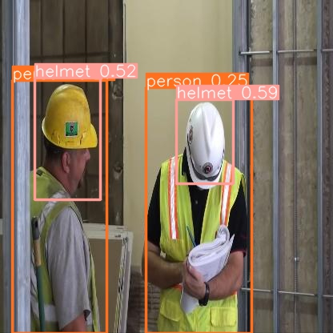

# YOLOv10 Helmet Detection with Streamlit
This project uses YOLOv10 to detect helmets in images and deploys the model using Streamlit.

## Installation

To set up the project, follow these steps:

**Clone the repository:**
```
git clone https://github.com/danghungdo/yolov10-helmet-detection.git
cd yolov10-helmet-detection
```

**Create and activate a virtual environment:**

On macOS and Linux:
```
python3 -m venv .venv
source .venv/bin/activate
```

On Windows:
```
python -m venv .venv
.\.venv\Scripts\activate
```
**Install dependencies:**
```
pip install -r requirements.txt
```

## Usage
1. Run the Streamlit application:
```
streamlit run app/main.py
```
2. Upload an image and see the helmet detection results.

## Result
Here is an example of the processed image
<p align='center'>
    

## Acknowledgements
- [YOLOv10](https://github.com/THU-MIG/yolov10)